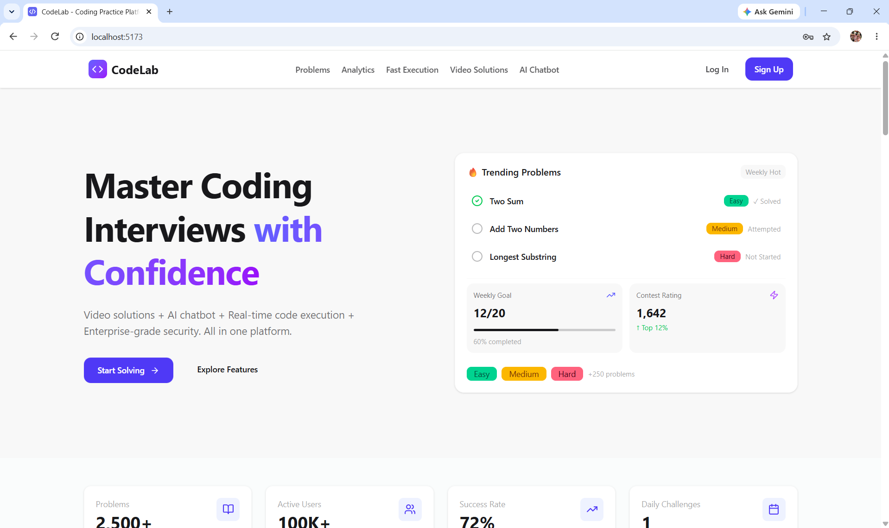
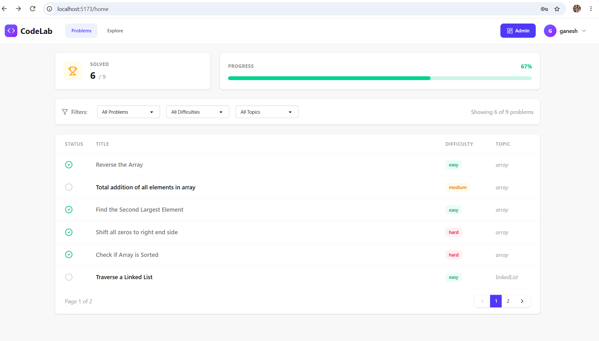
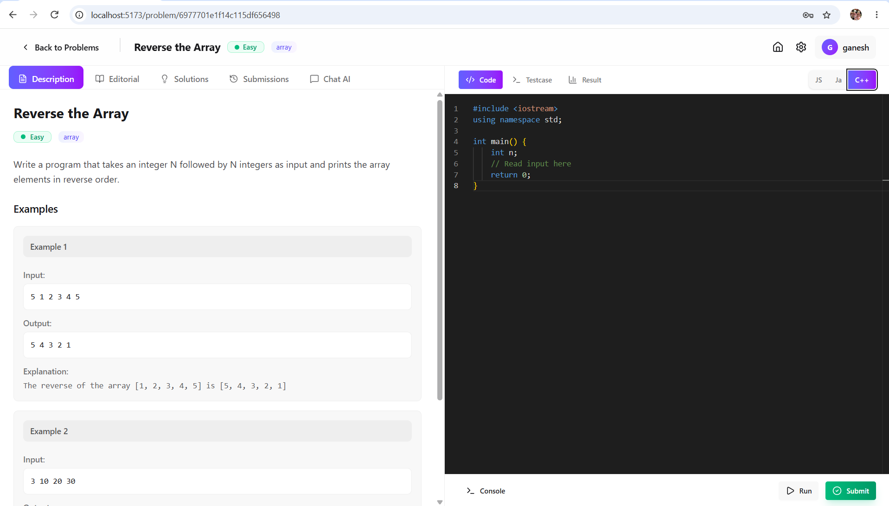
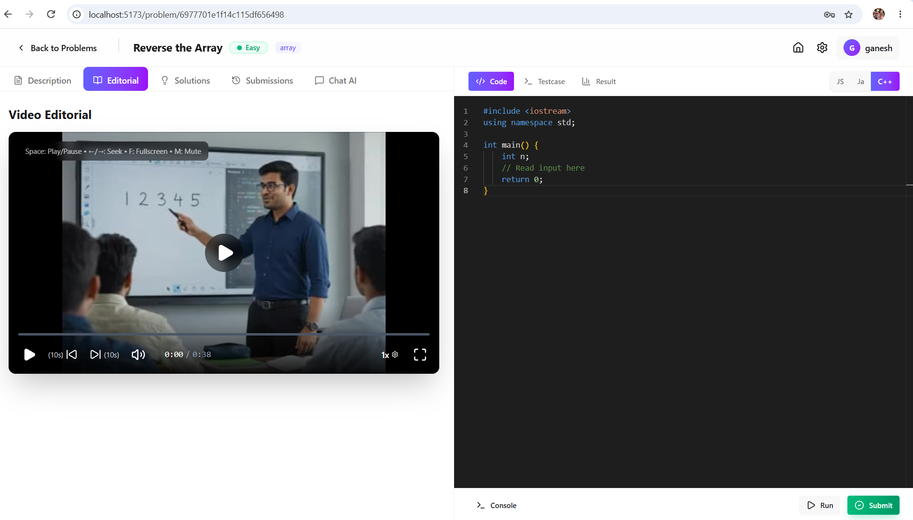
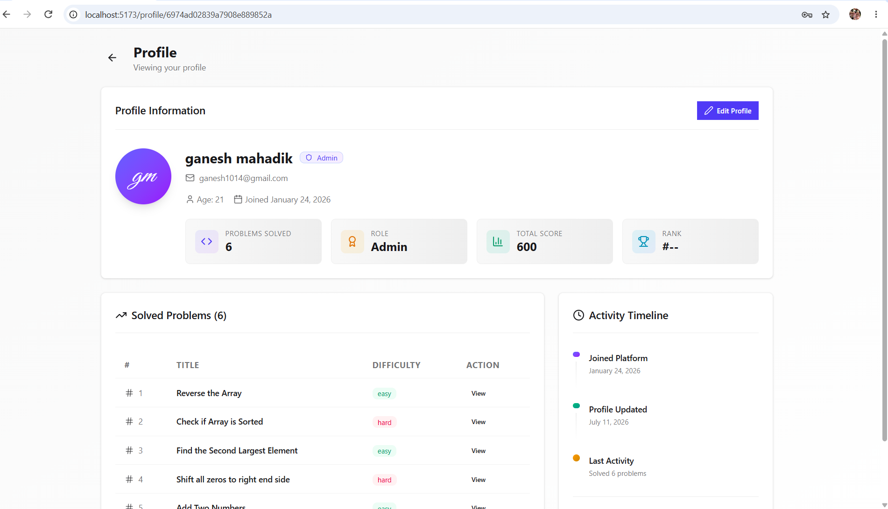
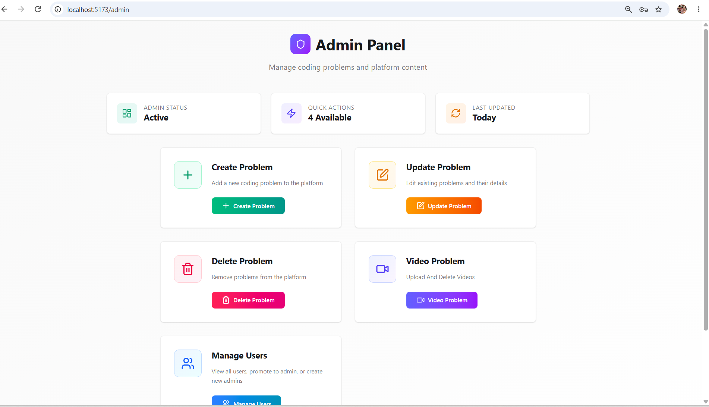
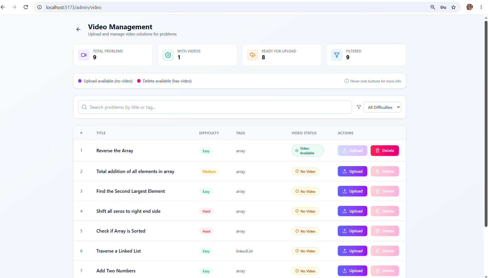
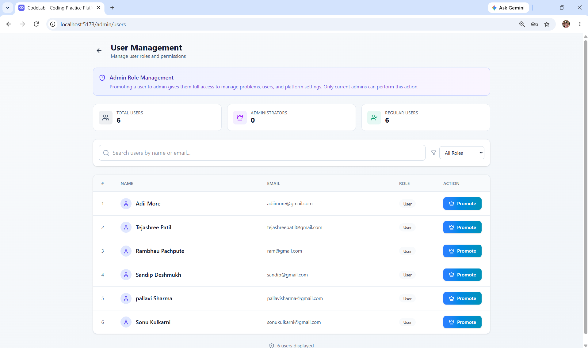

# 🚀 CodeLab

CodeLab is a full-stack MERN-based coding platform inspired by platforms like LeetCode. It allows users to solve programming problems, execute code online, track progress, watch editorial solutions, and get AI-powered coding assistance.

The platform also includes a complete admin management system for creating problems, managing users, uploading video solutions, and maintaining coding content.

---

# ✨ Features

## 👨‍💻 User Features

### Authentication & Security

* User registration and login
* JWT-based authentication with HTTP-only cookies
* Secure logout using Redis token blacklist
* Protected routes with role-based authorization
* Role-based access control (User/Admin)

### Coding Platform

* Browse and search coding problems
* Filter problems by difficulty and category
* Online code execution using Judge0 API
* Track solved problems
* View submission history

### Learning Features

* Editorial video solutions
* AI coding assistant powered by Google Gemini
* Problem explanations and coding guidance
* Responsive user interface with dark mode support

### UI/UX Features

* Consistent design system across all pages
* Custom CodeLab brand identity using a blue-purple gradient theme
* Dark and light mode support
* Platform-specific colors for better user recognition

---

# 🛠️ Admin Features

## Problem Management

* Create coding problems
* Update existing problems
* Delete problems
* Manage problem difficulty, tags, and descriptions

## Video Solution Management

* Upload editorial videos using Cloudinary
* Manage video availability per problem
* Prevent duplicate uploads
* Prevent invalid deletion actions using activity-based UI states

## User Management

* View registered users
* Promote users to admin
* Manage platform access

---

# 🖼️ Screenshots

## User Interface

### Landing Page



### Problem Solving







### User Dashboard



---

# Admin Panel

### Admin Dashboard



### Dashboard Management





---

# 🛠️ Tech Stack

## Frontend

* React.js
* Vite
* Tailwind CSS
* DaisyUI
* React Router
* Redux Toolkit
* Axios

## Backend

* Node.js
* Express.js
* MongoDB
* Mongoose
* Redis
* JWT Authentication
* Cloudinary
* Judge0 API
* Google Gemini API

---

# 📂 Project Structure

```text
CodeLab/
│
├── backend/
│   ├── src/
│   ├── package.json
│   └── .env.example
│
├── frontend/
│   ├── src/
│   ├── package.json
│   └── .env.example
│
├── screenshots/
│   ├── user/
│   │   ├── landing.png
│   │   ├── problemset.png
│   │   └── ...
│   │
│   └── admin/
│       ├── dashboard.png
│       ├── video-management.png
│       └── ...
│
└── README.md
```

---

# ⚙️ Installation & Setup

## Backend Setup

### 1. Navigate to backend

```bash
cd backend
```

### 2. Install dependencies

```bash
npm install
```

### 3. Create environment file

Create `.env` using `.env.example`.

Required variables:

| Variable              | Description               |
| --------------------- | ------------------------- |
| PORT                  | Backend server port       |
| ORIGIN                | Frontend URL              |
| DB_CONNECT_STRING     | MongoDB connection string |
| JWT_KEY               | JWT secret key            |
| JWT_ACCESS_EXPIRE     | JWT expiry time           |
| REDIS_USERNAME        | Redis username            |
| REDIS_PASS            | Redis password            |
| REDIS_HOST            | Redis host                |
| REDIS_PORT            | Redis port                |
| JUDGE0_KEY            | Judge0 API key            |
| JUDGE0_URL            | Judge0 API URL            |
| JUDGE0_HOST           | Judge0 API host           |
| GEMINI_API_KEY        | Google Gemini API key     |
| CLOUDINARY_CLOUD_NAME | Cloudinary cloud name     |
| CLOUDINARY_API_KEY    | Cloudinary API key        |
| CLOUDINARY_API_SECRET | Cloudinary API secret     |

### 5. Start backend

Development:

```bash
npm run dev
```

Production:

```bash
npm start
```

---

# Frontend Setup

### 1. Navigate to frontend

```bash
cd frontend
```

### 2. Install dependencies

```bash
npm install
```

### 3. Create environment file

Create `.env`:

```env
VITE_BASE_URL=http://localhost:4000
```

Replace it with your deployed backend URL when hosting.

### 4. Start frontend

```bash
npm run dev
```

---

# 🔐 Environment Security

Sensitive information is not included in this repository.

The following files are ignored:

* `.env`
* API keys
* Database credentials
* Cloudinary secrets
* Redis credentials

Use `.env.example` as a reference to create your own environment files.

---

# 🔴 Redis Usage

Redis is used for secure JWT logout handling.

When a user logs out:

1. JWT token is added to Redis blacklist.
2. Token remains blocked until expiration.
3. Protected routes reject blacklisted tokens.

If Redis becomes unavailable:

* The application can continue running.
* Basic cookie logout still works.
* Token blacklist functionality is temporarily unavailable.

---

# ☁️ Cloudinary Integration

Cloudinary is used for storing and managing editorial solution videos.

Features:

* Secure video upload
* Video URL management
* Video deletion support

---

# 🤖 AI Assistant

Google Gemini API powers the AI assistant.

Users can:

* Ask coding-related questions
* Get explanations
* Receive programming guidance

---

# ⚖️ Online Code Execution

Judge0 API is used for:

* Code compilation
* Program execution
* Submission evaluation

---

# 🚀 Deployment

Recommended deployment setup:

Frontend:

* Vercel

Backend:

* Render

Database:

* MongoDB Atlas

Storage:

* Cloudinary

---

# 📌 Future Improvements

Possible improvements:

* More programming languages
* Leaderboard system
* User discussion forum
* More detailed analytics
* Community solutions

---

# 📜 License

This project is created for learning and portfolio purposes.

Please do not claim this work as your own.

---

# 👨‍💻 Author

**Ganesh Mahadik**

If you like this project, consider giving it a ⭐ on GitHub.

